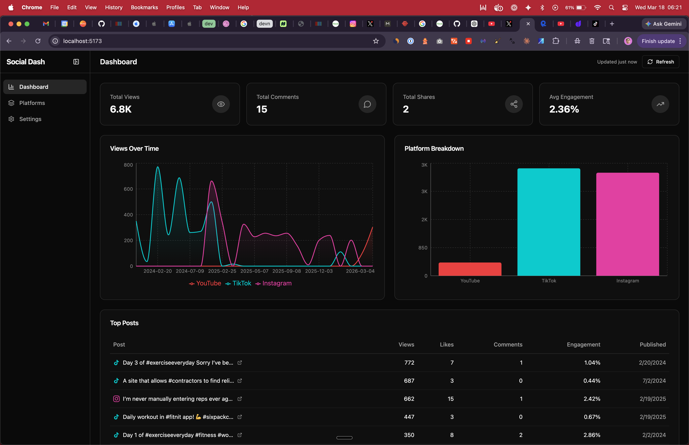
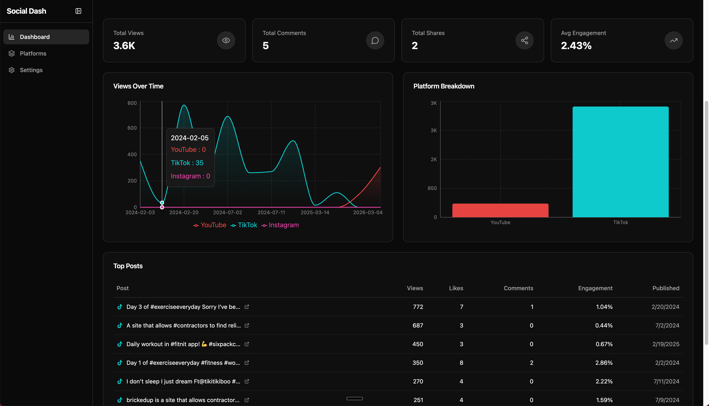

# Social Dash

A sleek, local-first social media analytics dashboard that aggregates views, comments, shares, and engagement rates across **YouTube**, **TikTok**, and **Instagram** in one place.





## Features

- **Unified dashboard** — see total views, comments, shares, and engagement % across all platforms at a glance
- **Views over time** — area chart showing view trends per platform with color-coded lines
- **Platform breakdown** — bar chart comparing total views across connected platforms
- **Top posts table** — sortable list of your best-performing content with direct links
- **Per-platform detail** — tabbed view with post grids, thumbnails, and individual metrics
- **Dark theme** — clean, card-based dark UI with platform accent colors (YouTube red, TikTok cyan, Instagram pink)
- **Local-only storage** — API keys and cached data stored in localStorage, nothing sent to any backend
- **Configurable API sources** — works with any RapidAPI provider for TikTok/Instagram (configurable host field)
- **Auto-refresh** — data refreshes every 5 minutes in the background
- **Debug tools** — "Preview API Response" button shows raw JSON to troubleshoot API integration

## Tech Stack

- **Vite** + **React 19** + **TypeScript**
- **Tailwind CSS v4** for styling
- **shadcn/ui**-style components (cards, buttons, tabs, inputs, skeletons, badges)
- **Zustand** with `persist` middleware for state management
- **Recharts** for data visualization
- **React Router v7** for routing
- **Lucide React** for icons

## Getting Started

### Prerequisites

- Node.js 18+
- API keys (see [API Setup](#api-setup) below)

### Install & Run

```bash
git clone https://github.com/cadenburleson/social-dash.git
cd social-dash
npm install
npm run dev
```

Open [http://localhost:5173](http://localhost:5173) in your browser.

### Build for Production

```bash
npm run build
npm run preview
```

### Docker

```bash
docker compose up
```

## API Setup

Navigate to the **Settings** page in the app. Each platform has step-by-step instructions and a direct link to get your keys.

### YouTube

1. Go to [Google Cloud Console](https://console.cloud.google.com/apis/credentials)
2. Create or select a project
3. Go to **APIs & Services > Library** and enable **YouTube Data API v3**
4. Go to **APIs & Services > Credentials > + CREATE CREDENTIALS > API key**
5. Copy the API key and paste it in Settings
6. Enter a channel name (e.g. `@MrBeast`) or channel ID (starts with `UC`)

### TikTok

1. Create a free [RapidAPI](https://rapidapi.com) account
2. Subscribe to a TikTok API (e.g. "TikTok Scraper")
3. On the API page, click any endpoint and look at **Code Snippets** (Target: Shell, Client: cURL)
4. Copy the `x-rapidapi-key` value into the **RapidAPI Key** field
5. Copy the `x-rapidapi-host` value (e.g. `tiktok-scraper7.p.rapidapi.com`) into the **RapidAPI Host** field
6. Enter the TikTok username you want to track (e.g. `@username`)

### Instagram

1. Use the same RapidAPI account (same key works across APIs)
2. Subscribe to an Instagram API (e.g. "Instagram Looter 2")
3. Copy the `x-rapidapi-key` and `x-rapidapi-host` from the Code Snippets panel
4. Enter the Instagram username you want to track

> **Tip:** Use the **"Preview API Response"** button in Settings to see raw JSON from the API. This helps verify your keys work and debug any data mapping issues.

## Project Structure

```
src/
├── components/
│   ├── dashboard/     # MetricCard, OverviewCards, EngagementChart, TopPostsTable, PlatformBreakdown
│   ├── layout/        # AppShell, Sidebar, Header
│   ├── platforms/     # PlatformCard, PostCard, PostGrid
│   ├── settings/      # ApiKeyForm with debug preview
│   ├── shared/        # EmptyState, ErrorState, LoadingState, PlatformIcon
│   └── ui/            # Button, Card, Input, Tabs, Badge, Skeleton
├── hooks/             # useAnalytics, useRefreshInterval
├── services/          # API clients for YouTube, TikTok, Instagram + types
├── store/             # Zustand stores (settings, analytics, UI)
├── pages/             # DashboardPage, PlatformsPage, SettingsPage
└── lib/               # utils, constants
```

## How It Works

1. **Settings** — Enter API keys and usernames per platform. Keys are saved to localStorage.
2. **Data fetching** — On dashboard load, the app calls all configured platform APIs in parallel using `Promise.allSettled` (one failure doesn't block others).
3. **Normalization** — Each platform's response is normalized into a unified `Post` type with consistent metrics fields.
4. **Caching** — Fetched data is cached in localStorage via Zustand persist. On page refresh, cached data displays immediately while fresh data loads in the background.
5. **Visualization** — Recharts renders the aggregated data as area charts, bar charts, and metric cards.

## Contributing

Contributions are welcome! Feel free to open issues or submit pull requests.

## License

MIT
